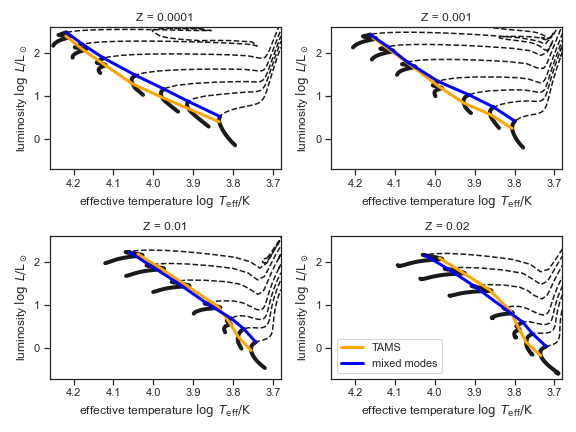

**MESA Summer School 2022**

Asteroseismology Across the HR diagram
===
Tutorial on modifying `run_star_extras.f90` in [MESA](https://docs.mesastar.org/) to run [GYRE](https://gyre.readthedocs.io), calculate non-radial oscillations, and find when mixed oscillation modes become observable. The tutorial can be viewed on the web [here](https://earlbellinger.com/mesa-summer-school-2022). 

Earl Patrick Bellinger1,2\
1 Max Planck Institute for Astrophysics, Germany\
2 Stellar Astrophysics Centre, Denmark

*August 11, 2022*

